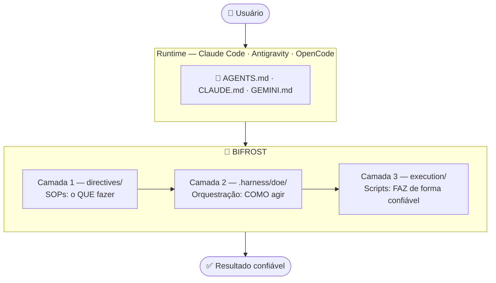
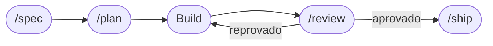
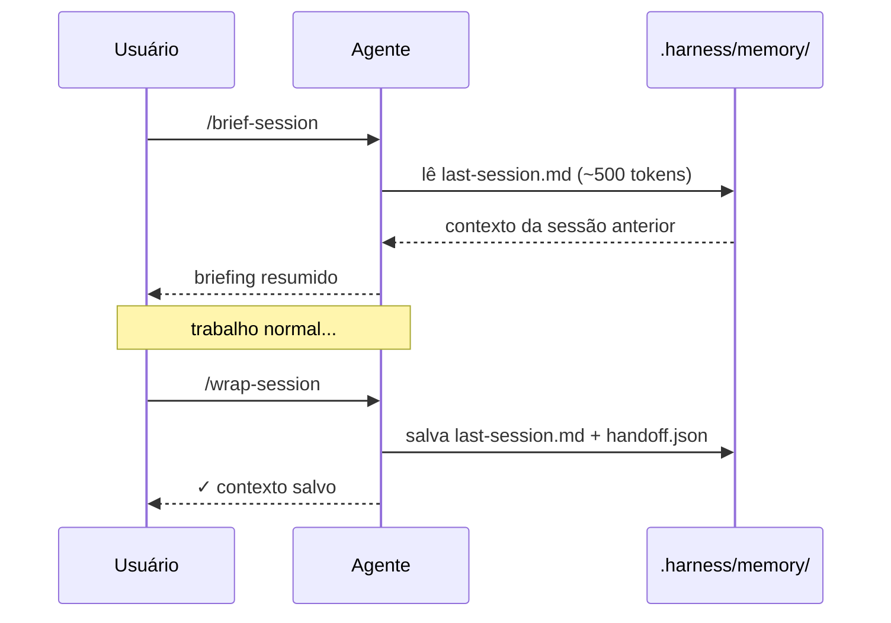

<div align="center">

```
██████╗ ██╗███████╗██████╗  ██████╗ ███████╗████████╗
██╔══██╗██║██╔════╝██╔══██╗██╔═══██╗██╔════╝╚══██╔══╝
██████╔╝██║█████╗  ██████╔╝██║   ██║███████╗   ██║
██╔══██╗██║██╔══╝  ██╔══██╗██║   ██║╚════██║   ██║
██████╔╝██║██║     ██║  ██║╚██████╔╝███████║   ██║
╚═════╝ ╚═╝╚═╝     ╚═╝  ╚═╝ ╚═════╝ ╚══════╝   ╚═╝
```

**O Sistema Operacional para Agentes de IA.**
**Um comando. Qualquer runtime. Zero infraestrutura.**

[](https://www.npmjs.com/package/harness-engineering)
[](LICENSE)
[](#changelog)
[](#compatibilidade)

</div>

---

## O problema que ninguém fala

Você dá uma tarefa ao Claude Code. Ele começa bem — lê arquivos, escreve código, parece produtivo. Depois algo vai errado. Ele pula um passo. Quebra um teste. Diz "feito" mas nada funciona. Você gasta mais tempo limpando do que se tivesse feito você mesmo.

**Isso não é problema do modelo. É problema de harness.**

A Anthropic demonstrou isso em experimento controlado:

```
Mesmo modelo (Opus 4.5) · Mesmo prompt ("build a 2D retro game editor")

❌ Sem harness  →  $9 · 20 minutos · não funcionou
✅ Com harness  →  $200 · 6 horas · jogo jogável e funcional
```

> *"O gargalo se moveu. Não é mais escrever código.*
> *É validar comportamento, capturar regressões, manter confiabilidade."*

---

## O que é o Bifrost

Na mitologia nórdica, **Bifrost** é a ponte que conecta todos os mundos.

```
╔══════════════════════════════════════════════════════╗
║                     BIFROST                          ║
║                                                      ║
║   Claude Code  ─────┐                                ║
║   Antigravity  ─────┼──── AGENTS.md ──── seu projeto ║
║   OpenCode     ─────┤     CLAUDE.md                  ║
║   Cursor       ─────┘     GEMINI.md                  ║
║                                                      ║
║   Um harness. Qualquer runtime. Mesmas regras.       ║
╚══════════════════════════════════════════════════════╝
```

```
Prompt Engineering    →  você funciona
Context Engineering   →  você é consistente
Harness Engineering   →  você é confiável em produção
```

---

## Instalação

> Requisito: [Node.js 16+](https://nodejs.org)

```bash
npx harness-engineering
```

```bash
npx harness-engineering check                     # verifica integridade
npx harness-engineering stats                     # métricas de sessões e tokens
npx harness-engineering skill --bundle essentials # instala skills
npx harness-engineering skill --list              # ver todas disponíveis
```

---

## Arquitetura de 3 Camadas



---

## Harness não é só para código

```
Agente jurídico     =  modelo + regras CC/2002 + templates  + verificador
Agente financeiro   =  modelo + regras fiscais + schemas    + auditoria
Agente imobiliário  =  modelo + histórico      + contratos  + alertas
Agente educacional  =  modelo + currículo      + progresso  + avaliação
```

---

## Ciclo SDLC Completo



```
/spec    → escreva a spec antes de qualquer código
/plan    → decomponha em tarefas verificáveis
/review  → quality gate com viés do avaliador
/ship    → checklist completo antes de deploy
```

---

## Memória entre Sessões



**Dois artefatos complementares:**

| Arquivo | Para quê |
|---------|---------|
| `last-session.md` | Contexto de conversa — retomar uma sessão interrompida |
| `handoff.json` | Estado estruturado do git — iniciar novo agente em feature longa |
| `claude-progress.txt` | Progresso de features — vinculado ao histórico de commits |

**Claude Code:**
```
/wrap-session      ← encerra, salva last-session.md + handoff.json
/brief-session     ← retoma com ~500 tokens em vez de 20k+
```

**Outros runtimes:**
```
python execution/handoff.py --create --tema "auth-jwt"
python execution/handoff.py --brief
```

---

## Economia de Tokens

| Técnica | Redução | Como |
|---------|---------|------|
| Lazy Loading | -80% | `.harness/index.md` → só a directive certa |
| Progressive Disclosure | -70% | `grep` em vez de `cat` |
| Observation Masking | -52% | `[Logs — 847 linhas \| FALHA \| timeout 42]` |
| Roteamento de Modelos | até -95% | Haiku / Sonnet / Opus por tipo de tarefa |
| Compressão de Histórico | -45% | `compress-history.py --auto` após 8 turnos |

---

## Hierarquia de Memória

```
L0 — AGENTS.md              → sempre presente · nunca descartar
L1 — .harness/index.md      → sempre presente · nunca descartar
L2 — .harness/domains/      → carregado sob demanda
L3 — directives/ · skills/  → carregado por match
L4 — memory/last-session.md → descartável após /wrap-session
```

---

## Três Tiers de Permissão

```
✅ PODE sem pedir    → ler arquivos, rodar testes, escrever em allowed_paths
⚠️  PERGUNTAR antes  → deletar arquivos, instalar deps, git commit/push, APIs externas
🚫 NUNCA            → protected_paths, reset --hard, credenciais hardcoded
```

Validação programática:
```bash
python execution/validate_action.py --action write_file --target src/auth.ts
# {"status": "VALID", "tier": "green"}

python execution/validate_action.py --action delete_file --target .env
# {"status": "INVALID", "tier": "red"}

python execution/validate_action.py --list-rules
```

---

## Princípios Karpathy

```
1. Declare suposições antes de agir — nunca escolha silenciosamente
2. Código mínimo — nada especulativo
3. Mudanças cirúrgicas — toque só o que deve
4. Transforme tarefas em critérios verificáveis
```

---

## Viés do Avaliador

```
"Presuma que o código está errado até que se prove o contrário."
"Se não encontrou nenhum problema → revise de novo."
Frase proibida: "O código parece correto."
```

---

## SupervisorAgent — Zero custo no caminho feliz

Ativa `directives/diagnose.md` automaticamente:

```
Gatilho 1 — Erro Explícito    → pare · diagnostique · não tente outra abordagem
Gatilho 2 — Anomalia          → pare · sinalize [ANOMALIA] · diagnostique
Gatilho 3 — Desvio do Plano   → pare · reporte · aguarde instrução
```

---

## Self-Correction Loop

```bash
# Analisa erros e atualiza harness-evolution.md automaticamente
python execution/self-correction.py --auto

# Com PR automático (requer GitHub CLI)
python execution/self-correction.py --auto --open-pr
```

---

## Métricas

```bash
npx harness-engineering stats
```

Mostra: sessões, tokens economizados, taxa de sucesso, aprendizados Hashimoto, saúde do harness.

---

## Context7 — Documentação Sempre Atualizada *(v2.4.0)*

O modelo foi treinado em uma data específica. As bibliotecas evoluem. Sem Context7, o agente pode gerar código com APIs desatualizadas ou que mudaram de sintaxe.

```
Sem Context7:
  Next.js 14 API → agente usa Pages Router → erro → 3 turnos de correção = 20k tokens

Com Context7:
  ctx7 docs /vercel/next.js "middleware" → 3k tokens de docs atuais → implementação correta
```

### Por Runtime

**Claude Code / OpenCode / Cursor — setup nativo:**
```bash
npx ctx7 setup --claude     # Claude Code
npx ctx7 setup --opencode   # OpenCode
npx ctx7 setup --cursor     # Cursor

# Uso:
ctx7 docs /vercel/next.js "middleware authentication"
ctx7 docs /prisma/prisma "one-to-many relations"
ctx7 docs /colinhacks/zod "form validation"
ctx7 library [nome]          # encontra o ID
```

**Antigravity — sem suporte nativo, use web search:**
```
"Busque a documentação oficial do Next.js 15 sobre middleware
e use a versão atual da API antes de implementar."
```

### Quando usar (regra seletiva)

```
✅ USE: versão importa · primeira vez com a API · setup/config/auth
❌ NÃO: operações básicas · já consultou nesta sessão · libs nativas
```

### Bibliotecas mais usadas

| Biblioteca | ID Context7 |
|-----------|------------|
| Next.js | `/vercel/next.js` |
| React | `/facebook/react` |
| Prisma | `/prisma/prisma` |
| Zod | `/colinhacks/zod` |
| Tailwind | `/tailwindlabs/tailwindcss` |
| Supabase | `/supabase/supabase` |
| FastAPI | `/tiangolo/fastapi` |
| Pydantic | `/pydantic/pydantic` |
| ShadCN UI | `/shadcn-ui/ui` |

---

## Quality Gate

| Verificação | O que bloqueia |
|-------------|----------------|
| 🔑 Segredos | passwords, api_keys, tokens hardcoded |
| 📝 `console.log` | logs soltos em JS/TS |
| ⚠️ TypeScript `any` | sem `// harness-ignore` |
| 💰 Float monetário | valores monetários em ponto flutuante |
| 🔒 `.env` | commit sem ser `.example` |
| 🛡️ Protected paths | definidos em `.harness/config.json` |
| 🔄 Auto-sync | AGENTS.md → CLAUDE.md + GEMINI.md |
| 🧑‍⚖️ Agent Judge | Haiku audita directives (opcional, requer API key) |

---

## Regra de Hashimoto

> *Cada bug que não vira regra do harness é um bug que vai acontecer de novo.*

```
1. Corrija o código
2. Identifique onde o harness falhou
3. Atualize a directive correspondente
4. Commit: harness(tipo): descrição
```

Automático: `python execution/self-correction.py --auto`

---

## Community Skills

```bash
npx harness-engineering skill nextjs         # Next.js 14+ App Router
npx harness-engineering skill python-fastapi # FastAPI + Pydantic v2
npx harness-engineering skill lgpd           # Conformidade LGPD Brasil
npx harness-engineering skill --bundle sdlc  # ciclo completo de entrega
```

> Contribua: [bifrost-community-skills](https://github.com/JRoberto1/bifrost-community-skills)

---

## Compatibilidade

| Runtime | Arquivo | SDLC | Memória | Tokens |
|---------|---------|------|---------|--------|
| Claude Code | `CLAUDE.md` | `/spec /plan /review /ship` | `/wrap-session` | `/context-check` |
| Antigravity | `GEMINI.md` | prompt direto | manual | script Python |
| OpenCode | `AGENTS.md` | prompt direto | manual | script Python |
| Cursor | `.cursorrules` | prompt direto | manual | — |

---

## Changelog

### v2.4.0
- ✨ Context7 — documentação atualizada antes de implementar com libs externas
- ✨ `.harness/skills/context7/SKILL.md` — skill com suporte Claude Code, OpenCode, Cursor
- ✨ `GEMINI.md` — alternativa via web search para Antigravity
- ✨ Regra seletiva de uso (não usa para tudo — economiza tokens)
- 🔄 `AGENTS.md` · `CLAUDE.md` · `GEMINI.md` — seção Context7 integrada
- 🔄 `.harness/index.md` — skill Context7 indexada

### v2.3.0
- ✨ Viés do Avaliador no `/review` e `agents/code-reviewer.md`
- ✨ `execution/validate_action.py` — validação programática dos 3 tiers
- ✨ `execution/handoff.py` — handoff JSON estruturado para novo agente
- ✨ `execution/self-correction.py` — `--open-pr` para PR automático

### v2.2.0
- ✨ `npx harness-engineering stats` — métricas de sessões e tokens
- ✨ `execution/self-correction.py` — Hashimoto automático
- ✨ `.harness/quality-gates/agent-judge.sh` — auditor Haiku
- ✨ Community Skills — Next.js, FastAPI, LGPD

### v2.1.0
- ✨ Hierarquia de memória L0→L4
- ✨ Três Tiers de Permissão
- ✨ SupervisorAgent — 3 gatilhos em `directives/diagnose.md`
- ✨ `claude-progress.txt` — progresso vinculado ao git

### v2.0.0
- ✨ Camada 2 (`.harness/doe/`) visível na arquitetura
- ✨ Intent Gate · Princípios Karpathy · Frases Proibidas
- ✨ Ciclo SDLC: `/spec` `/plan` `/review` `/ship`
- ✨ `directives/diagnose.md` · `directives/spec-driven.md`
- ✨ `agents/code-reviewer.md` · `agents/security-auditor.md`
- ✨ `.harness/config.schema.json` · `scripts/sync-mirrors.sh`
- ✨ `cli.js` v2.0.0 completo

### v1.4.0
- ✨ Nome: **Bifrost** · README com identidade nórdica
- ✨ `.harness/config.json` — protected/allowed paths
- ✨ `directives/harness-evolution.md`
- ✨ `scripts/sync-mirrors.sh`

### v1.3.0
- ✨ Progressive Disclosure · Observation Masking
- ✨ Roteamento de Modelos · Sub-agentes · `/model-select`

### v1.2.0
- ✨ Lazy loading · Output conciso · Budget por tarefa
- ✨ `compress-history.py` · `/context-check`

### v1.1.0
- ✨ Memória persistente · `/wrap-session` · `/brief-session`

### v1.0.0
- Estrutura base · DOE · PEV · 4 domínios · quality gate · npm

---

## Princípios

```
 1. Agente = Modelo + Harness
 2. Marcha dos Noves — o harness resolve
 3. Directives são documentos vivos
 4. Scripts determinísticos > agente improvisando
 5. Verificador com contexto limpo
 6. Sucesso silencioso, falha barulhenta
 7. Hashimoto — cada erro melhora o harness
 8. Memória persistente          · v1.1.0
 9. Contexto mínimo necessário   · v1.2.0
10. Modelo certo para cada tarefa · v1.3.0
11. Intenção antes de execução    · v2.0.0
12. Spec antes de código          · v2.0.0
13. Ceticismo ativo no review     · v2.3.0
14. Validação antes da ação       · v2.3.0
15. Docs atualizadas antes de implementar · v2.4.0
```

---

## Licença

MIT — use, modifique, distribua, contribua.

---

<div align="center">

*Na mitologia nórdica, Bifrost é a ponte que conecta todos os mundos.*
*Aqui, conecta seus projetos a qualquer agente de IA.*

**[⭐ Star](https://github.com/JRoberto1/Bifrost_Harness-Engineering) · [📦 npm](https://www.npmjs.com/package/harness-engineering) · [🤝 Community](https://github.com/JRoberto1/bifrost-community-skills)**

</div>
